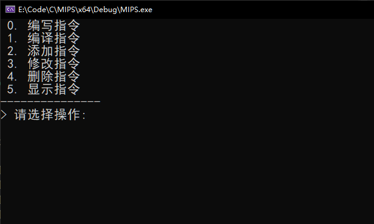
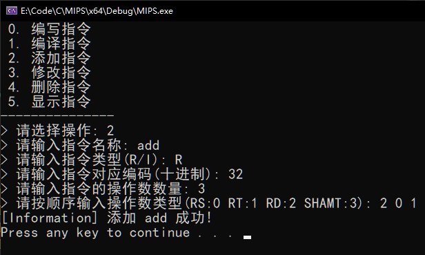
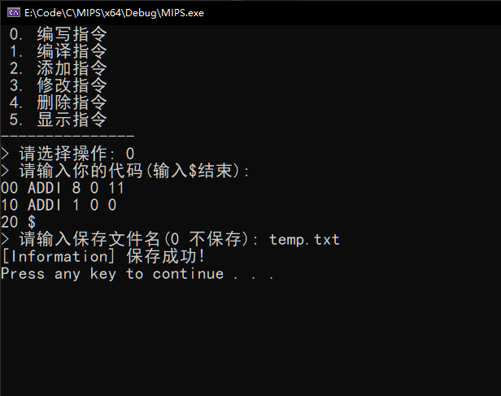
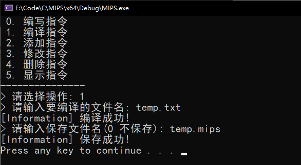
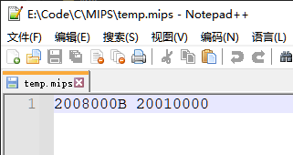

# MIPS编译器文档

## 一、问题背景

在计算机组成原理实验课程中，我们需要设计MIPS架构的CPU。但在如此庞大的处理器设置过程中，一个简单的小错误就很可能被放大成灾难性的错误。因此，如何通过简单的程序快速调试CPU设计的Bug，就显得尤为重要。因此，本程序旨在将MIPS指令编译成对应的机器指令，方便用户将编写好的MIPS程序投入CPU中的使用。

本程序相较于同类软件，具有轻量和易于使用的特点，同时，程序覆盖的功能与授课内容紧密贴合。

下面我将分别介绍MIPS下的指令特点，本程序的使用信息，和程序未来可以改进的地方。

## 二、指令介绍

MIPS中所有指令都是32位的定长指令，分为一下三种类型

1. Register 寄存器型
2. Immediate 立即数型
3. Jump 无条件转移型

由于本实验中不涉及到J型指令，因此本程序主要覆盖的是R型指令和I型指令的编译任务。由于指令结构比较简单，相对固定，且数量不多，因此为我们程序的开发提供了可行性。接下来我将分别介绍R型指令和I型指令的特点，并列举本实验所覆盖的指令。

> Refer: [MIPS指令简介]( https://www.cnblogs.com/dreamingoutloudly/p/13067099.html#:~:text=MIPS%E6%8C%87%E4%BB%A4%E7%9A%84%E5%9F%BA%E6%9C%AC%E6%A0%BC%E5%BC%8F,%E7%9A%84%E6%98%AF%E6%97%A0%E6%9D%A1%E4%BB%B6%E8%BD%AC%E7%A7%BB%E5%9E%8B%E3%80%82&text=R%E5%9E%8B%E6%8C%87%E4%BB%A4%E6%A0%BC%E5%BC%8F%E5%8C%85%E5%90%AB,%E5%9D%87%E4%B8%BA5%E4%B8%AA%E6%AF%94%E7%89%B9%E3%80%82)

###  Register: 寄存器型

指令结构：OP(6) + rs(5) + rt(5) + rd(6) +shamt(5) + funct(6)

* 采用扩展操作码形式（OP字段值为0，具体指令功能由6位`funct`字段决定）

* `rs`、 `rt`、 `rd`为寄存器操作数字段，可访问32个通用寄存器
* `shamt`字段是移位变量，只用于移位指令，其他指令无效

| funct | 指令           | 功能描述                                                  |
| ----- | -------------- | --------------------------------------------------------- |
| 12    | `syscall`      | 系统调用，这里实现停机指令                                |
| 32    | `add rd rs rt` | 加法指令：R[rd] <- R[rs] + R[rt]                          |
| 42    | `slt rd rs rt` | 小于置位指令，有符号比较：R[rd] <- (R[rs])<R[rt]) ? 1 : 0 |

### Immediate: 立即数型

指令结构：OP(6) + rs(5) + rt(5) + Imm(16)

* `rs`、 rt为寄存器操作数字段，可访问32个通用寄存器
* `Imm`字段为16位有符号立即数字段

| OP   | 指令              | 功能描述                                                     |
| ---- | ----------------- | ------------------------------------------------------------ |
| 04   | `beq rs rt imm `  | 相等跳转：if(R[rs] == R[rt]) PC ← PC + 4 + SignExt18b(imm<<2)； |
| 05   | `bne rs rt imm `  | 不等跳转：if(R[rs] != R[rt]) PC ← PC + 4 + SignExt18b(imm<<2)； |
| 08   | `addi rt rs imm ` | 立即数加：R[rt] ← R[rs]+SignExt16b(imm) ；                   |
| 35   | `lw rt imm rs `   | 取数指令：R[rt] ← Mem4B(R[rs] + SignExt16b(imm)) ；          |
| 43   | `sw rt imm rs) `  | 存数指令：Mem4B(R[rs]+SignExt16b(imm)) ← R[rt]；             |

## 三、程序介绍

本程序已经实现了MIPS指令设置和编译的基本功能。下面我将详细介绍目前本程序已经实现了的功能。

### 交互方式

目前本程序的使用需要使用CLI的交互方式，用户可以输入对应的指令ID选择指令不同的指令。



### 指令设置

指令设置包括指令的添加、修改、删除和显示。本项目主要是教学使用，因此没有覆盖所有执行的类型，用户可以根据实际需求自行添加。目前我们添加指令的模板已经覆盖了R型指令和I指令，并且能够自如添加本实验覆盖的所有指令。添加后的指令会以二进制的形式存储在外部文件，程序关闭后再打开，可以读取该文件之前已经添加过的指令。

> 现在是存储C++对象，代码的可扩展性不高，后续开发中将采用JSON文件进行存储

下面是添加功能的简单演示，用户首先输入2进入添加功能界面。然后按照要求分别输入指令的基本信息（名称、类型和对应操作码）、参数数量和类型。如果程序检测无误之后就能正常添加。最后，按下任意键就能回到一开始的交互界面。



通过“显示指令”就可以显示全部已经添加的指令。指令的添加和修改在此不重复演示。


### 代码编译

本程序提供了代码编写的功能，用户选择编写指令功能后，就可以开始编写代码，然后可以选择保存代码文件。但本功能完成度较低，只能追加修改。因此建议使用其他的文本编辑器编写MIPS代码并保存。



本程序的核心功能就是将MIPS指令编译成对应的机器码。通过输入编写好的代码文件路径，程序会根据输入的指令名称和参数类型解析和编译每条MIPS指令，并检验代码格式是否正确。如果编译成功就会结果输出到用户给定的文件路径下。



最终编译结果会以32位十六进制编码保存，并且每个指令以空格分割。这样设计的目的是为了方便将指令导入Logisim的存储器中。



## 四、未来工作

目前，本程序已经实现了MIPS指令设置和编译的基本功能，下面我将列出为了将要改进的方向。

1. **解耦MIPS指令设置和编译：**编译代码的使用频率是远大于代码设置的，因此将本程序分成两个模块单独运行。

2. **优化代码编译的使用方式：**参考gcc编译器的使用方式，提供使用本程序的效率。

   ```
   // 编译temp.txt文件并保存到temp.mips中
   mipsc temp.text -o temp.mips
   ```

3. **提高程序的鲁棒性：**在程序测试中，有些非法输入可能会导致程序的崩溃，此方面仍需提高。

4. **优化指令信息的存储方式：**我们将使用JSON文件存储已经设置好的代码信息，依次提供更好的可拓展性。